# NFV HLD

## Index

---

\- 1. Introduction

\- 2. Scope

\- 3. 3GPP Architecture

\- 3.1. 3GPP Architecture

\- 3.2. OSS Overview

\- 3.3. NF Overview

\- 4. NFV Architecture

\- 4.1. NFV Architecture

\- 4.2. Architecture Overview

\- 4.3. Kubernetes

\- 4.4. コンポーネント概要

\- 4.4.1. master

\- 4.4.2. node

\- 4.5. MANO function

\- 4.6. VNF

\- 4.7. Object Overview

\- 4.8. Pod Layout

\- 4.9. Description of non-NF functions

\- 5. Physical Network Design

\- 5.1. Physical Network Design

\- 5.2. Network Overview

\- 6. Logical Network Design

\- 6.1. CNI

\- 6.2. Design

\- 6.2.1. Calico

\- 6.2.2. Multus

\- 6.2.2.1. N1N2

\- 6.2.2.2. N3

\- 6.2.2.3. N4

\- 6.2.2.4. N9

\- 7. Traffic Flow

\- 7.1. Traffic Flow

\- 7.1.1 UE

\- 7.1.2 gNB

\- 7.1.3 AMF

\- 7.1.4 SMF

\- 7.1.5 UPF

\- 7.1.6 NRF

\- 8. IP Design

\- 8.1. 5GC IP Design

\- 9. References

## 1. Introduction

---

本書は、Aillumissionの学習環境について、ハイレベルな情報を提供するものです。

一般的な設計原則を概説し、3GPP 5GCアーキテクチャ、EPCアーキテクチャ、ネットワーク機能に関する技術的な説明を提供します。
　　
このサービスでは、仮想基盤として、Kubernetesを採用しています。

本書では、ハイレベルな設計に加え、コンテナ間の相互接続についてもカバーしています。

5GC、SAE-GW、EPCに関連する他の要素に関する情報は、本文書の対象外とします。

本書の目的は、製品やロードマップの説明や、ハードウェアの容量に関するものではありませんのでご注意ください。最新情報は、適切な公式文書を参照してください。

 

## 2. Scope

---

本書の設計範囲は以下の通りです。

- 3GPP Architecture
- NFV Architecture
- Physical Network Design
- Logical Network Design
- Traffic Flow

 

## 3. 3GPP Architecture

---

### 3.1. 3GPP Architecture

この表は3GPPで定義されたアーキテクチャと使用するOSSの相関図を示しています。

  
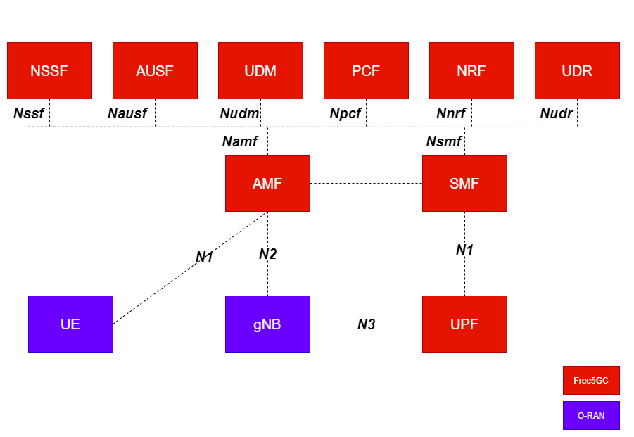
  

### 3.2. OSS Overview

- Free5GC

  free5GCは、第5世代モバイルコアネットワークのためのオープンソースプロジェクトです。

  このプロジェクトの最終目標は、3GPP Release 15以降で定義されている5Gコアネットワークを実装することです。

- UERANSIM

  オープンソースの最先端の5G UEおよびRANの実装です。

  これは、基本的には5Gの携帯電話と基地局と考えることができます。

  このプロジェクトは、5Gコアネットワークのテストや5Gシステムの研究に利用できます。

 

### 3.3. NF Overview

| NF | 説明 |
| :-: | :- |
| UE | ユーザ端末 |
| gNB | 無線アクセス |
| AMF | N2インタフェースを終端し、登録管理、接続管理、移動管理の機能を担います |
| SMF | セッション管理の機能を担い、UEへのIPアドレス割当管理やUPFの選択・制御を行います。 |
| UPF | PDUセッションに対してユーザー・パケットのルーティング・転送を行います。 ハンドオーバー時のアンカーポイント機能、ポリシー制御の実施機能などを担います。 |
| NSSF | UEにサービスを提供するネットワークスライス・インスタンスのペアを選択し使用するAMFを決定する。NSSAIとS-NSSAIと呼ばれる識別子をもとにスライスを形成し、SMFを選択しAMFへ通知する |
| AUSF | 認証情報を保持する。 |
| UDM | 加入者契約情報やAKA認証のための認証情報を保存する |
| UDR | 同じPLMN内にあるデータを保存したり、データを取得する機能を提供します。 |
| PCF | 各種のポリシー・ルールを保持し、ポリシー実施のためにコントロールプレーン機能に提供します |
| NRF | 利用可能なNFインスタンスとそのサポートするサービスのNFプロファイルを維持します。新たに登録、更新、登録解除されたNFインスタンスとそのNFサービスを、登録したNFサービ ス・コンシューマに通知します。 |

 

## 4. NFV Architecture

---

### 4.1. NFV Architecture

この表はETSIで定義されたアーキテクチャと使用するOSSの相関図を示しています。

  
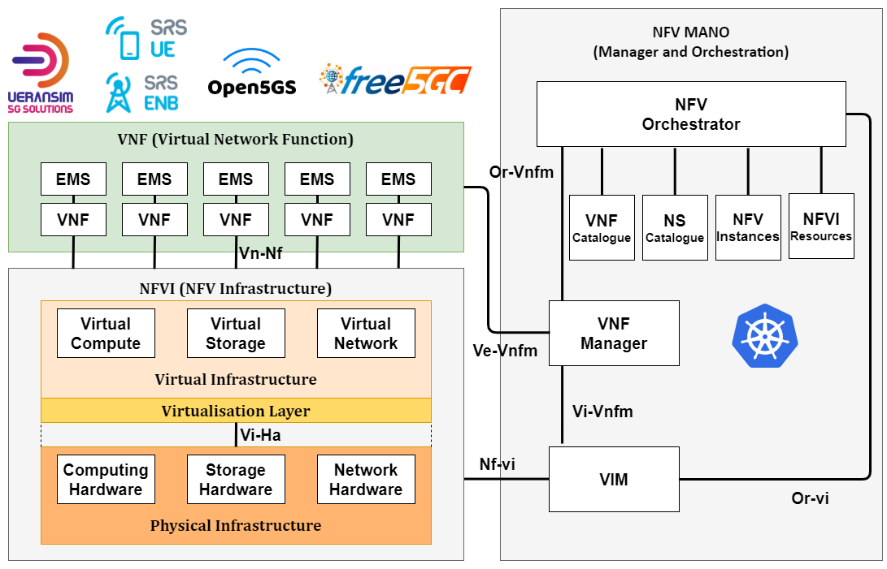
  

### 4.2. Architecture Overview

- NFV MANO

  ハードウェアリソース、ソフトウェアリソース、VNFの管理機能とオーケストレーション機能を提供します。

- NFV Orchestrator

  自動化の中心的な役割を担う。

- VNFM

  VNFの管理を担う。

- VIM

  NFVIの制御を担う。

- VNFI

  VNFを実行するための物理リソースと仮想化機能です。

- VNF

  VNFを実行するための物理リソースと仮想化機能です。

- Catalogue

  リソースを定義する構成ファイル。

 

### 4.3. Kubernetes

この表は、Kubernetesの基本的なアーキテクチャを示しています。

  
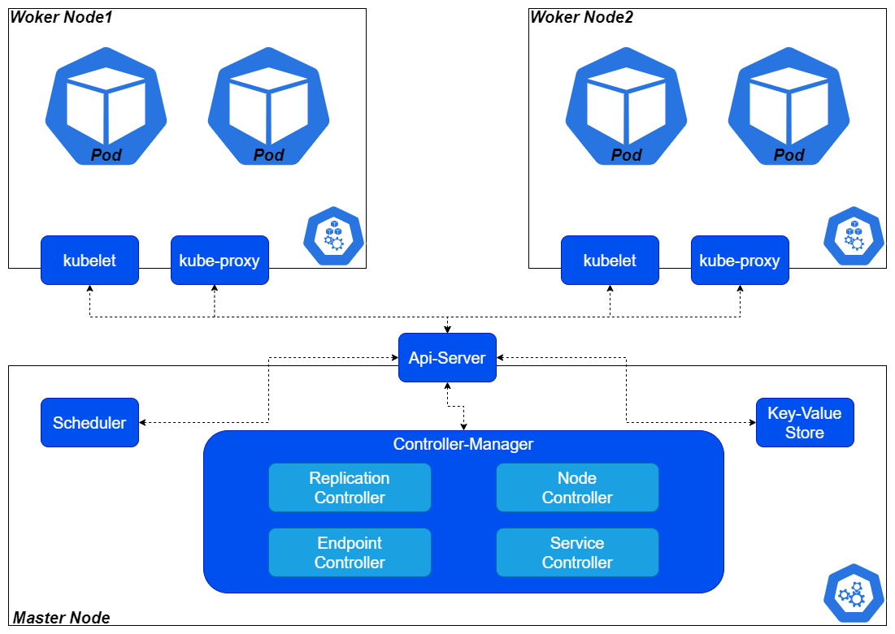
  

本学習環境では、Master1台、node2台を構築します。

- master
- node1
- node2

 

### 4.4. コンポーネント概要

### 4.4.1. master

- api-server

  APIサーバーは、Kubernetes APIを外部に提供するKubernetesコントロールプレーンのコンポーネントです。

- kube-controller Manager

  コントロールプレーン上で動作するコンポーネントで、複数のコントローラープロセスを実行します。

- kube-Scheduler

  コントロールプレーン上で動作するコンポーネントで、新しく作られたPodにノードが割り当てられているか監視し、

  割り当てられていなかった場合にそのPodを実行するノードを選択します。

- etcd

  一貫性、高可用性を持ったキーバリューストアで、Kubernetesの全てのクラスター情報の保存場所として利用されています。

### 4.4.2. node

- kubelet

  クラスター内の各ノードで実行されるエージェントです。各コンテナがPodで実行されていることを保証します。

- kube-proxy

  クラスター内の各nodeで動作しているネットワークプロキシで、KubernetesのServiceコンセプトの一部を実装しています。

 

### 4.5. MANO function

| NFV function | Delivery |
| :- | :- |
| Manual Healing | Yes via Kubernetes |
| Auto Healing | Yes via Kubernetes |
| Manual Scale-out | Yes via Kubernetes |
| Auto Scale-out | No. Future use. |
| Manual Scale-in | Yes via Kubernetes |
| Auto Scale-in | No. Future use. |

 

### 4.6. VNF

この表はVNFをクラスターにデプロイした際に展開されるオブジェクトについて示しています。

  
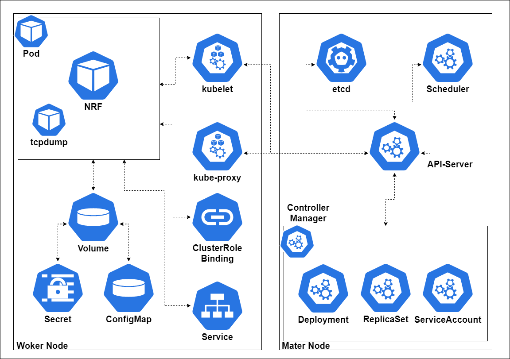
  

### 4.7. Object Overview

- Deployment

  PodとReplicaSetの宣言的なアップデート機能を提供します。

- Replicaset

  ReplicaSetの目的は、どのような時でも安定したレプリカPodのセットを維持することです。

- Pod

  Kubernetes内で作成・管理できるコンピューティングの最小のデプロイ可能なユニットです

- Service

  Podの集合で実行されているアプリケーションをネットワークサービスとして公開する抽象的な方法です。

- Service Account

  Pod内のプロセスがapi-serverにアクセスするのを可能とします。

- ClusterRoleBinding

  組織内の個々のユーザーのRoleをベースに、コンピューターまたはネットワークリソースへのアクセスを制御する方法です。

- Volume

  コンテナのデータは一時的なもので、Podが削除されればデータが消えてしまう。

  また、コンテナがクラッシュしてKubernetesが再起動させてくれば場合でもコンテナのデータは消えてしまう。

  Volumeはデータの永続化をしてくれる。

  永続化したいデータは指定したVolumeに保存することで削除やクラッシュした際でもデータが残る。

  また、Volumeは別の目的でも使用される。それはPod内でのコンテナ間のデータ共有だ。

- ConfigMap

  Podにコンフィギュレーションデータを注入する方法を提供します。

- Secret

  パスワード、OAuthトークン、SSHキーのような機密情報を保存し、管理できるようにします。

 

### 4.8. Pod Layout

この表はPodに収容されるコンテナについて示しています。

  
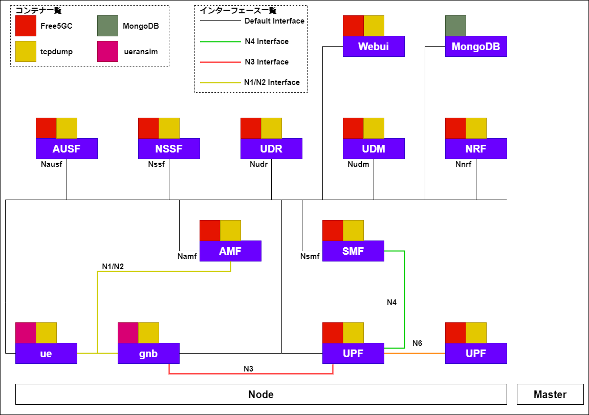
  

### 4.9. Description of non-NF functions

- webui

  web上でユーザを登録する機能を提供します。

- mongodb

  NRFと連携して、データを保存、検索します。

 

## 5. Physical Network Design
---

### 5.1. Physical Network Design

本書では、VirtualBox及びVagrantを用いて作成されたネットワークを物理ネットワークとして扱います。

この表は、VMと物理ネットワークを示しています。

  
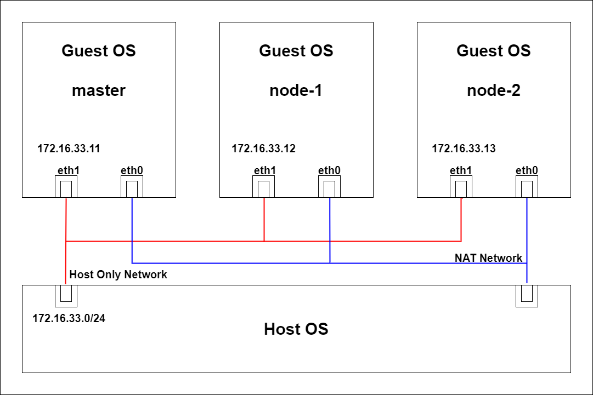
  

### 5.2. Network Overview

- Host Only Network

  Host及びGuest間での通信を目的として使用されます。

- NAT Network

  VMがInternetに接続することを目的として使用されます。

 

## 6. Logical Network Design
---

### 6.1. CNI

- Calico

  コンテナ、仮想マシン、ホストベースのワークロードのためのオープンソースのネットワーク及びネットワークセキュリティのソリューションです。

- Multus

  KubernetesのCRDベースのネットワークオブジェクトを使用して、Kubernetesのマルチネットワーク機能をサポートするMulti CNIプラグインです。

 

### 6.2. Design

### 6.2.1. Calico

この表は、Calicoによって作成された論理ネットワークを示しています。

このネットワークは、コンテナのCoreDNSへのアクセス、SBIへの接続を目的として使用されます。

  
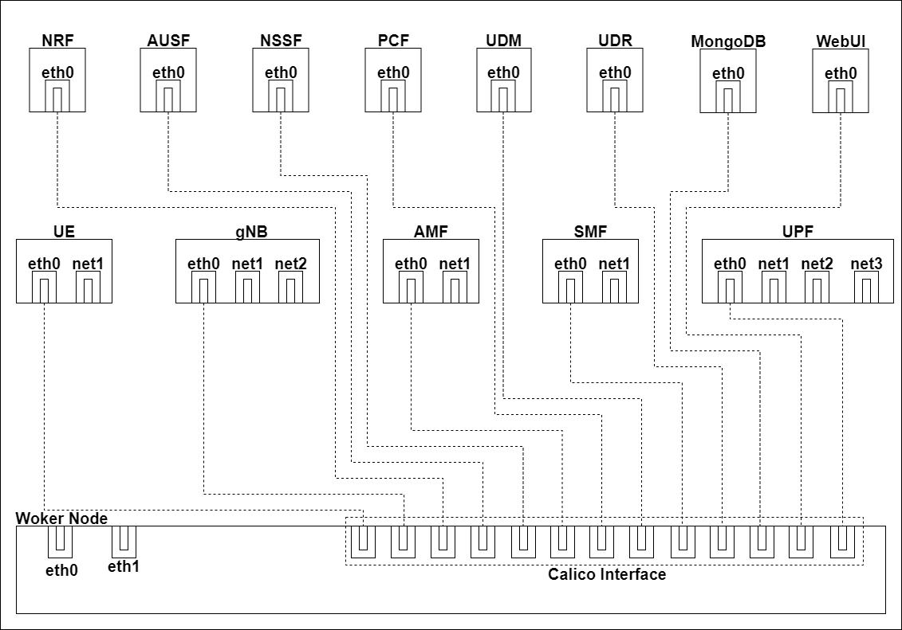
  

### 6.2.2. Multus

この表はMultusによって作成さてた論理ネットワークを示しています。

このネットワークは、特定の機能を提供する目的で使用されます。

  
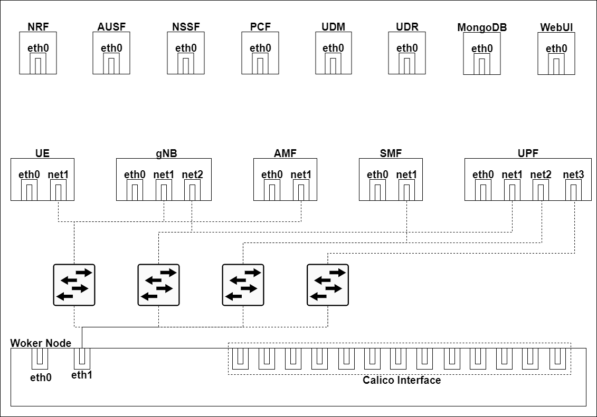
  

### 6.2.2.1. N1N2

このネットワークは、UE、gNB、AMF間の通信を目的として使用されます。

  
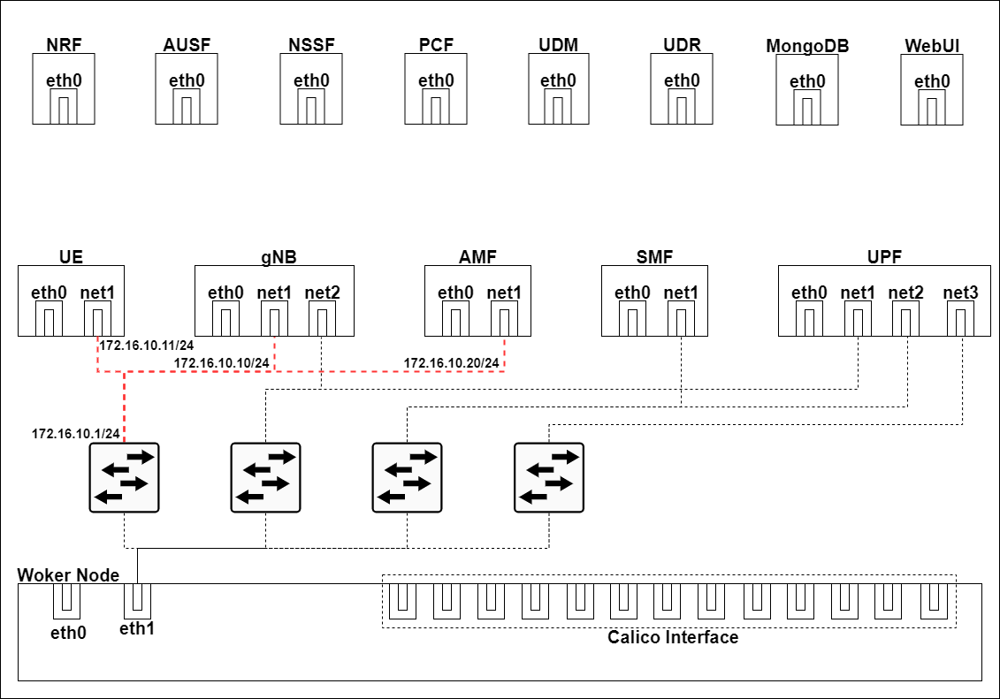
  

### 6.2.2.2. N3

このネットワークは、gNB、UPF間の通信を目的として使用されます。

  
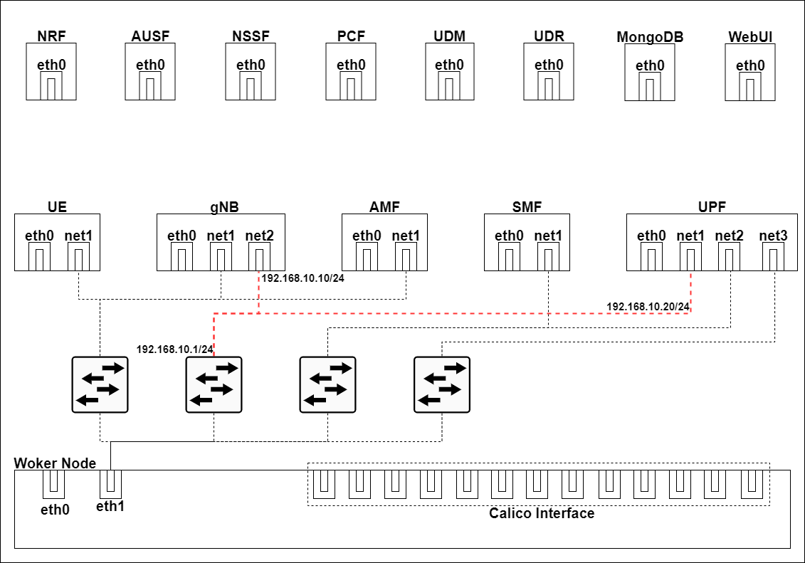
  

### 6.2.2.3. N4

このネットワークは、SMF、UPF間の通信を目的として使用されます。

  
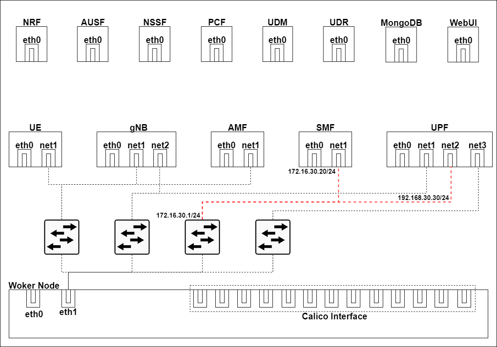
  

### 6.2.2.4. N9

このネットワークは、UPF間の通信を目的として使用されます。

  
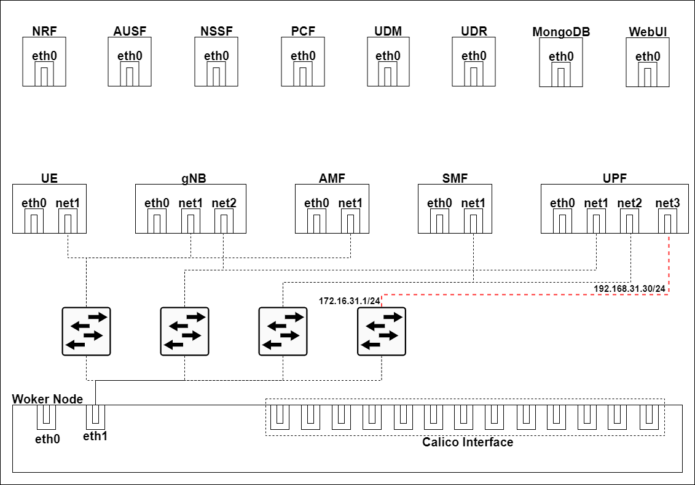
  

## 7. Traffic Flow
---

### 7.1. Traffic Flow

この表は各Podのトラフィックフローについて示しています。

### 7.1.1 UE

- eth0

  Kubernetes関連サービスへのアクセスに使用されます。

- net1

  gNBへのアクセスに使用されます。

  
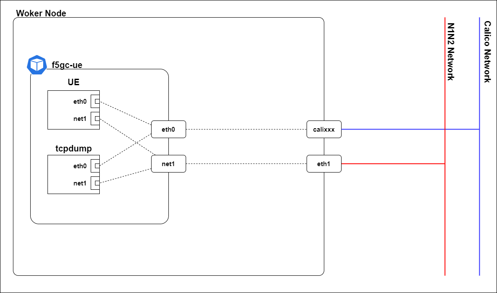
  

### 7.1.2 gNB

- eth0

  Kubernetes関連サービスへの通信を目的として使用されます。

- net1

  UE、AMFへの通信を目的として使用されます。

- net2

  UPFへの通信を目的として使用されます。

  
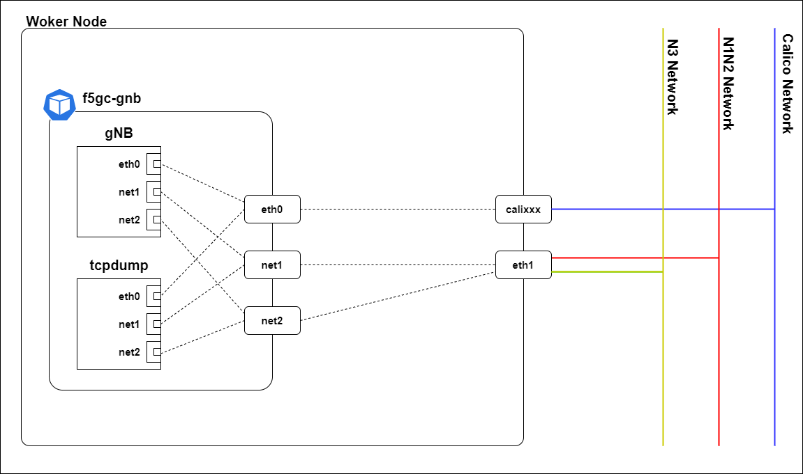
  

### 7.1.3 AMF

- eth0

  Kubernetes関連サービス、SBIへの通信を目的として使用されます。

- net1

  gNBへの通信を目的として使用されます。

  
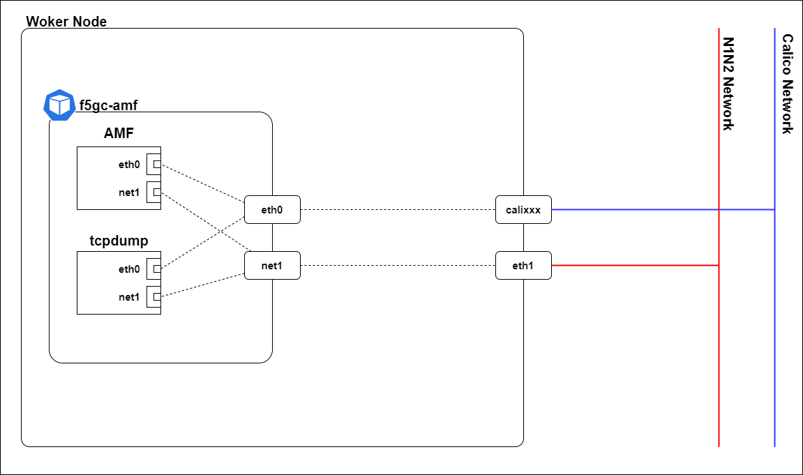
  

### 7.1.4 SMF

- eth0

  Kubernetes関連サービス、SBIへの通信を目的として使用されます。

- net1

  SMFへの通信を目的として使用されます。

  
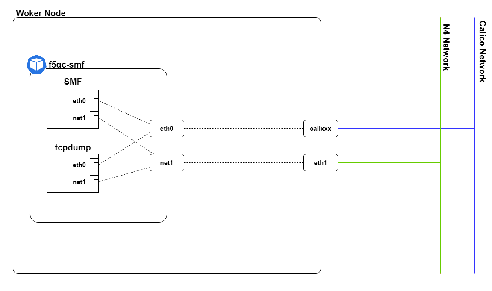
  

### 7.1.5 UPF

- eth0

  Kubernetes関連サービスへの通信を目的として使用されます。

- net1

  gNBへの通信を目的として使用されます。

- net2

  SMFへの通信を目的として使用されます。

- net3

  UPFへの通信を目的として使用されます。

  
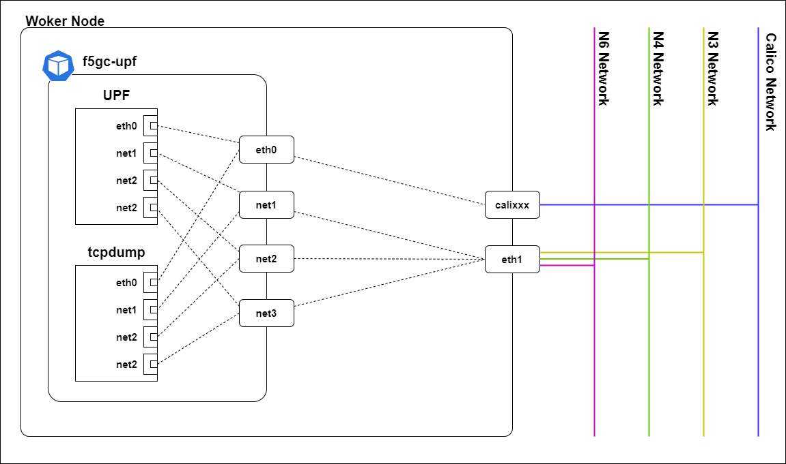
  

### 7.1.6 NRF

このレイアウトはその他のNFでも同様なものが適用されます。

- eth0

  Kubernetes関連サービス、SBIへの通信を目的として使用されます。

  
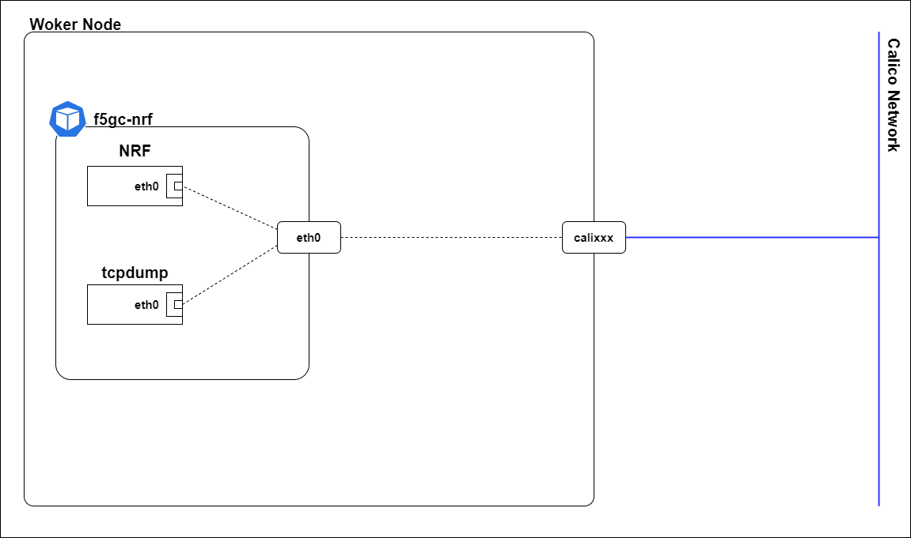
  

<!--
## 4G

## Architecture

  
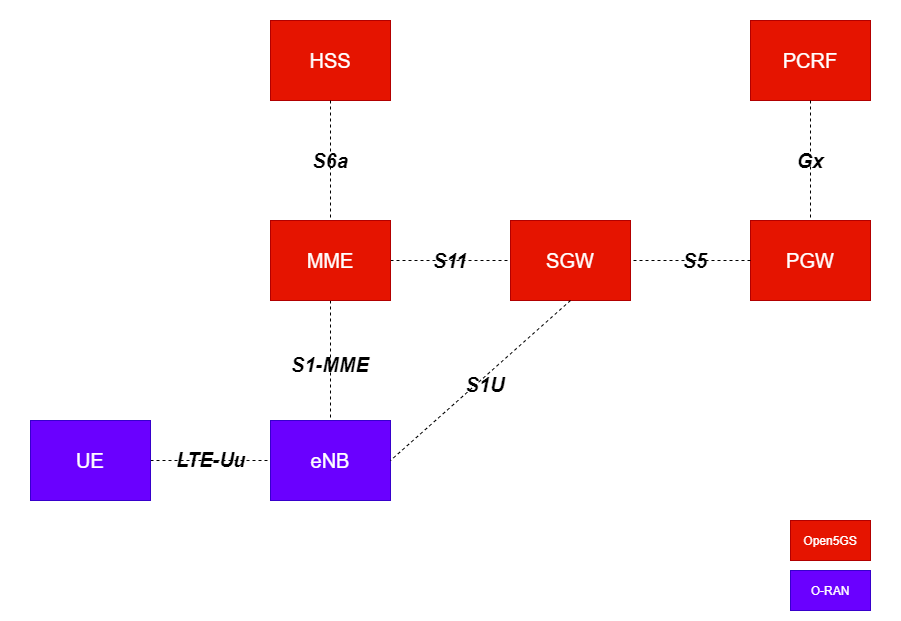
  

## Pod design
--->

## 8. IP Design

### 8.1. 5GC IP Design
---

| NF | Interface | IP | Type | CNI |
| :-: | :- | :- | :- | :- |
| UE   |        | 10.244.0.0/16    | dynamic | Calico |
|      | N1     | 172.16.10.11/24  | static  | Multus |
| gNB  |        | 10.244.0.0/16    | dynamic | Calico |
|      | N2     | 172.16.10.10/24  | static  | Multus |
|      | N3     | 192.168.10.10/24 | static  | Multus |
| AMF  | Namf   | 10.244.0.0/16    | dynamic | Calico |
|      | N1, N2 | 172.16.10.20/24  | static  | Multus |
| SMF  | Nsmf   | 10.244.0.0/16    | dynamic | Calico |
|      | N4     | 172.16.30.20/24  | static  | Multus |
| UPF  |        | 10.244.0.0/16    | dynamic | Calico |
|      | N3     | 192.168.10.20/24 | static  | Multus |
|      | N4     | 172.16.30.30/24  | static  | Multus |
|      | N9     | 192.168.30.31/24 | static  | Multus |
| NSSF | Nnssf  | 10.244.0.0/16    | dynamic | Calico |
| AUSF | Nausf  | 10.244.0.0/16    | dynamic | Calico |
| UDM  | Nudm   | 10.244.0.0/16    | dynamic | Calico |
| UDR  | Nudr   | 10.244.0.0/16    | dynamic | Calico |
| PCF  | Npcf   | 10.244.0.0/16    | dynamic | Calico |
| NRF  | Nnrf   | 10.244.0.0/16    | dynamic | Calico |

## 9. References
---

- [Free5GC](https://github.com/free5gc/free5gc)
- [UERANSIM](https://github.com/aligungr/UERANSIM)
- [Kubernetes](https://kubernetes.io/ja/docs/concepts/overview/what-is-kubernetes/)
- [3GPP-23.501](https://www.3gpp.org/ftp/Specs/archive/23_series/23.501/23501-h00.zip)
- [NFV-ETSI](https://www.etsi.org/committee/nfv)
